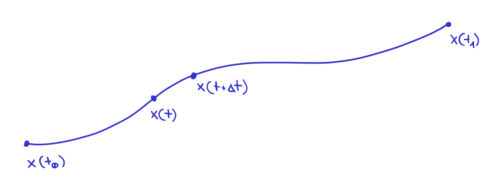

# Bellman's principle of optimality

For a dynamic system with state feedback in the form

\dot{\bm{x}} = \bm{f}(\bm{x},\bm{u},τ) \;,\quad \bm{u} = \bm{u}(\bm{x})

where  \bm{x}(τ)  are the system's states and  \bm{u}(\bm{x})  a function of state feedback inputs, we may define for the trajectory from state  \bm{x}(t)  to state  \bm{x}(T)  an objective function

J_{t→T} = ∫_{t}^{T} L(\bm{x},\bm{u},τ)\,dτ


---

For any state  \bm{x}(\tau)  there exists an optimal input  \bm{u}^*(τ)  for achieving the desired state at time  T 

\bm{u}^* = \argmin_{\bm{u}} J_{t→T}

where an objective function achieved with optimal inputs will be referred to as *Bellman function*

J_{t→T}^* = \min_{\bm{u}} J_{t→T}


## Bellman's equation

If we are searching for the optimal input at state  \bm{x}(t) , we may separate the entire trajectory into two segments:

1.  \bm{x}(τ) \,,\; τ ∈ ⟨t,t+Δt)  with an objective function  \int_t^{t+Δt} L\,dτ 
2.  \bm{x}(τ) \,,\; τ ∈ ⟨t+Δt,T⟩  with an objective function  J_{t+Δt→T} 

For the defined segments we may write the Bellman function in the form of the so-called *Bellman equation*

J_{t→T}^* = \min_{\bm{u}} \left( \int_t^{t+Δt} L\,dτ + J_{t+Δt→T} \right)


## Bellman's differential equation

The term  J_{t+Δt→T}  can be expanded into

J_{t+Δt→T}
=
J_{t→T}
+
∫_{t}^{t+Δt} \frac{dJ_{t→T}}{dτ} dτ

whereby its substitution we attain

J_{t→T}^*
=
\min_{\bm{u}} \left(
	∫_t^{t+Δt} L\,dτ
	+
	J_{t→T}
	+
	∫_{t}^{t+Δt} \frac{dJ_{t→T}}{dτ} dτ
\right)

As

J_{t→T}^* = \min_{\bm{u}} \left( J_{t→T} \right)

the term  J_{t→T}  cancels out with the left side of the equation

0
=
\min_{\bm{u}} \left(
	∫_t^{t+Δt}
	L +
    \frac{dJ_{t→T}}{dτ}
    \ dτ
\right)

and we may perform the manipulation

\frac{dJ_{t→T}}{dτ}
=
\frac{∂J_{t→T}}{∂\bm{x}} \bm{f}
+
\frac{∂J_{t→T}}{∂τ}

Its substitution results in the equation

0
=
\min_{\bm{u}} \left(
∫_t^{t+Δt}
L + \frac{∂J_{t→T}}{∂\bm{x}}\bm{f} + \frac{∂J_{t→T}}{∂τ}
\ dτ
\right)


---

If  Δt→0 , we may approximate the integral with a Reimann sum and manipulate the resulting equation into the general form (independent from the interval) of the *Bellman's differential equation*

%\left.
-\frac{∂J^*}{∂τ}
%\right|_{τ=t}
=
%\left.
\min_{\bm{u}} \left(
	L
	+
	\frac{∂J}{∂\bm{x}}	
	\bm{f}
\right)
%\right|_{τ=t}

evaluated at time  τ = t  from which we may derive the Linear Quadratic Regulator and with modifications, Pontrjagin's minimum principle.