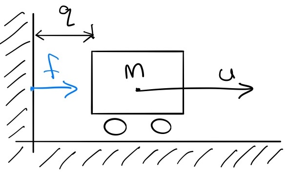

rigid contact in equations of motion can be inforced by a single quadratic equality constraint (QEC) and two linear inequality constraint (LIC)

\begin{aligned}
	\text{QEC} &:& \bm{ϕ}(\bm{q})⋅\bm{f} &= 0
	\\
	\text{LIC} &:& \bm{\phi}(\bm{q}) &≥ 0
	\\
	\text{LIC} &:& \bm{f} &≥ 0
\end{aligned}

both off which can be implemented as quadratic inequalities in the form

\frac{1}{2} \bm{x}^T\bm{Q}_i\bm{x} + \bm{r}_i^T\bm{x} + c_i ≥ 0 \;,\quad i = 1,\dots,p

used by QCQP solvers

### Example
Take a simple cart

Its equations of motion can be written as

m\ddot{q} = u + f

suplemented by contact constraints

	fq = 0
	\;,\quad 
	q ≥ 0
	\;,\quad 
	f ≥ 0


## Forward Dynamics
Solving a single step of dynamics can be formulated as finding a solution to a Linear Complementarity Problem (LCP)

\operatornamewithlimits{find}_{\bm{z}} \ \text{s.t.}: \quad 0 \leq (\bm{q} + \bm{M}\bm{z}) \perp \bm{z} ≥ 0


First the descrete step of the simulation must be approximated using the semi-implicit Euler scheme

\begin{aligned}
\bm{q}_{n+1} &≈ \bm{q}_n + h \dot{\bm{q}}_{n+1} \\
\dot{\bm{q}}_{n+1} &≈ \dot{\bm{q}}_n + h \ddot{\bm{q}}_n
\end{aligned}

where we will assume dynamics in the general form

\bm{H}\ddot{\bm{q}}_{n} = \bm{τ}(\bm{q}_n,\dot{\bm{q}}_n,\bm{u}_n) + \bm{J}(\bm{q}_n)\bm{f}_n

After consecutive substitutions we attain the approximation

\underbrace{ \bm{q}_{n+1} }_{\bm{w}}
=
\underbrace{
	\bm{q}_n + h \dot{\bm{q}}_n + h^2 \bm{H}^{-1}\bm{τ}(\bm{q}_n,\dot{\bm{q}}_n,\bm{u}_n)
	}_{\bm{q}}
+
\underbrace{h^2 \bm{H}^{-1}\bm{J}(\bm{q}_n)}_{\bm{M}}
\underbrace{\bm{f}_n}_{\bm{z}}

with the terms of the LCP under the braces

---

More on the topic can be read in [B3.3](https://underactuated.mit.edu/multibody.html#section3) of Russ Tedrake's underactuated notes.